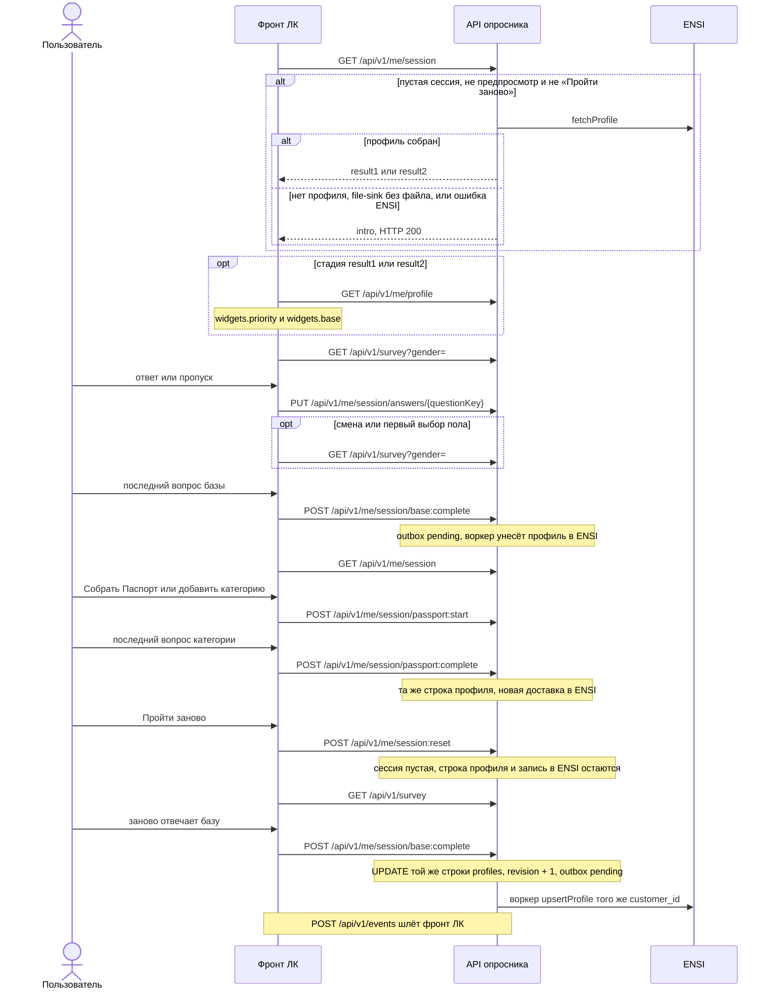
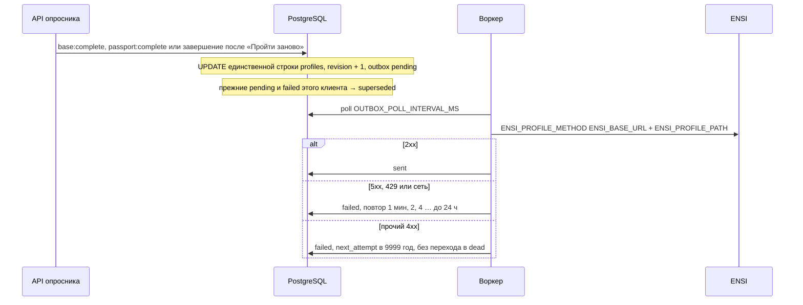
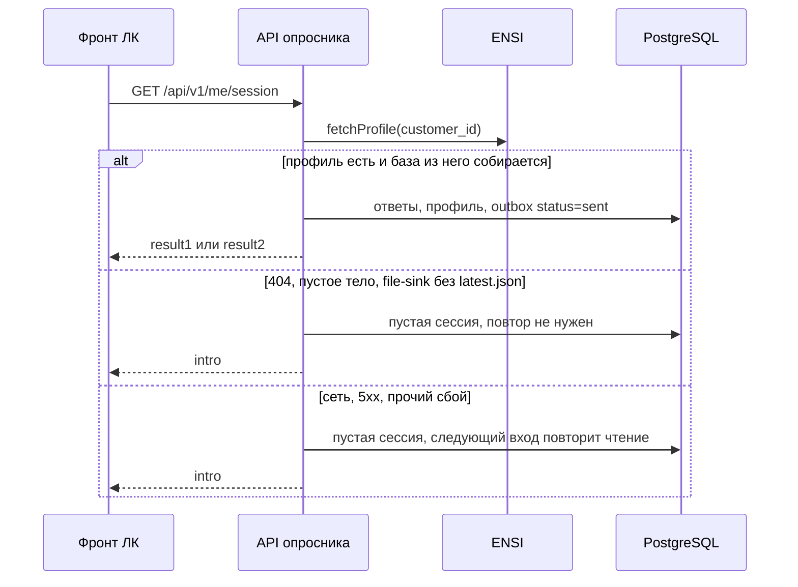
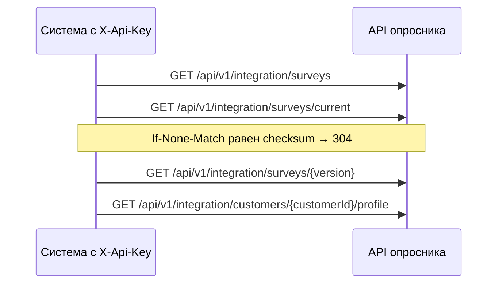
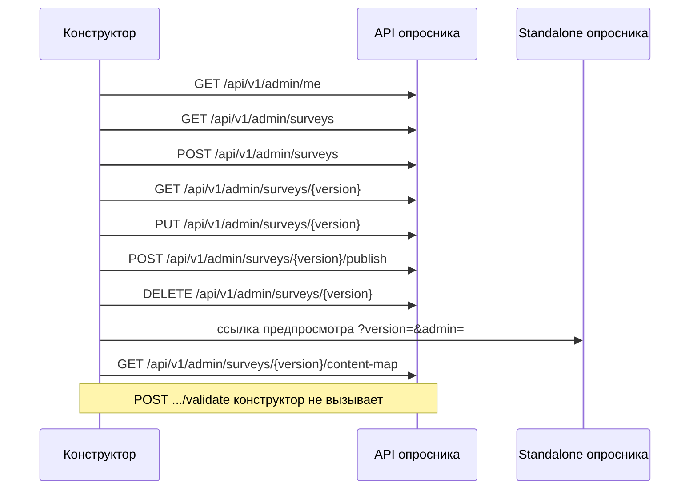

# Методы API

Справочник по маршрутам `apps/api`. Для каждого метода указано, кто его вызывает и в какой момент. Конверт ответа: `{ "data", "meta"?, "errors"?: [{ "code", "message", "meta"? }] }`.

OpenAPI: `GET /api/v1/openapi.json` и Swagger UI `/docs`, если `SWAGGER_ENABLED=true`. Схемы безопасности названы так же, как заголовки:

| Имя в OpenAPI | Тип | Заголовок | Откуда значение |
|---|---|---|---|
| `bearer` | http bearer, JWT | `Authorization: Bearer` | токен пользователя ЛК |
| `X-Api-Key` | apiKey | `X-Api-Key` | env `INTEGRATION_API_KEY` |
| `X-Admin-Token` | apiKey | `X-Admin-Token` | env `ADMIN_TOKEN` |

Глобальная схема — `bearer`. `GET /survey`, `/health`, `/ready` и `/metrics` объявлены с `security: []`. Схемы `dev` и безымянного `apiKey` в спецификации нет. Заголовок `X-Customer-Id` в OpenAPI не описан: это только стенд `AUTH_MODE=dev`.

Как фронт ЛК вызывает эти методы — [`INTEGRATION.md`](INTEGRATION.md).

## Кто с кем говорит

| Контур | Направление | Авторизация | Зачем |
|---|---|---|---|
| Опросник для пользователя | фронт ЛК → API опросника | `Authorization: Bearer`, JWT пользователя ЛК | Конфиг, сессия, ответы, расчёт, коды виджетов, аналитика |
| ENSI, приём | воркер опросника → метод ENSI | `ENSI_AUTH_HEADER` / `ENSI_AUTH_VALUE` | Доставка профиля. Метод реализует команда ENSI |
| ENSI, чтение при входе | API опросника → ENSI | тот же сервисный доступ | `fetchProfile` на пустом входе |
| Сервисное чтение | система с ключом → API опросника | заголовок `X-Api-Key`, схема OpenAPI `X-Api-Key`, значение `INTEGRATION_API_KEY` | Забрать опубликованный опросник или профиль без JWT пользователя |
| Конструктор | `apps/admin` → API | заголовок `X-Admin-Token` | Черновики и публикация |
| Служебные методы | оркестратор, Prometheus → процесс | нет | `health`, `ready`, `metrics`. Это не роль |

Эталонный `<idb-beauty-quiz>` ходит в те же методы сессии, что и фронт ЛК. Для интеграции ЛК он не нужен.

Лимит `RATE_LIMIT_PER_MINUTE` (по умолчанию 60 запросов в минуту) стоит на `PUT /me/session/answers/{questionKey}` и на `POST /events`. Ключ лимита — `customerId`, иначе IP. Остальные методы сессии лимитом маршрута не закрыты. Сервисное чтение ограничено 600 запросами в минуту на IP: у ключа нет `customerId`, поэтому ключ лимитера — адрес клиента. `GET /survey`, health и конструктор лимитом маршрута не закрыты.

## Методы фронта ЛК

Их вызывает фронт личного кабинета. Эталон `apps/web/src/api/client.ts` делает то же самое и для интеграции не обязателен.

Ниже — порядок одного прохода. Профиль только что завершённого этапа фронт берёт из ответа `base:complete` и `passport:complete`. `GET /me/profile` нужен, когда сессия уже на `result1` или `result2`: оттуда берутся коды виджетов ЛК.



Кнопки «Назад» и «Начать» HTTP не вызывают. «Позже» на анонсе Паспорта тоже не меняет сессию: фронт только шлёт аналитику `passport_postponed`.

| Метод | Когда вызывает фронт ЛК | Ответ |
|---|---|---|
| `GET /api/v1/me/session` | Открытие. Ещё раз после `base:complete`, после `passport:complete` и если завершение этапа вернуло ошибку | Сессия. Пустой вход залогиненного клиента читает профиль из ENSI и открывает `result1` или `result2`. Нет профиля, пустой file-sink и ошибка ENSI оставляют `intro` и отвечают 200 |
| `GET /api/v1/survey` | Сразу после сессии, с полом из `derived.gender`. Повторно после ответа на `gender`. После сброса — без пола | Конфиг под пол. Без пола в запросе — только вопрос `gender` |
| `PUT /api/v1/me/session/answers/{questionKey}` | Каждый выбор single, «Далее» на multi и «Пропустить» | Сессия и `meta.genderReset` |
| `POST /api/v1/me/session/base:complete` | Отвечен последний вопрос базы | `BeautyProfile`. Та же строка профиля клиента обновляется, в outbox встаёт доставка |
| `POST /api/v1/me/session/passport:start` | «Собрать Паспорт» или «добавить категорию», тело `{ "category" }` | Сессия со стадией `passport` |
| `POST /api/v1/me/session/passport:complete` | Отвечен или пропущен каждый вопрос категории, тело `{ "category" }` | `BeautyProfile`. Та же строка профиля обновляется, в outbox — новая доставка |
| `POST /api/v1/me/session:reset` | «Пройти заново» | Новая пустая сессия. Старая архивируется. Профиль клиента не удаляется и в ENSI не уходит; следующее завершение обновит ту же запись |
| `POST /api/v1/events` | Пакет до 100 событий аналитики | `202`, `{ "data": { "accepted" } }` |

`GET /survey` для опубликованной версии идёт без JWT. В предпросмотре черновика конструктор добавляет `X-Admin-Token`. Остальные методы таблицы требуют JWT пользователя. Заголовок `X-Customer-Id` эти методы принимают только при `AUTH_MODE=dev`; в production процесс с таким режимом не стартует.

`GET /api/v1/me/session` для фронта ЛК авторизуется только JWT пользователя. Query `version` — предпросмотр черновика конструктора: без заголовка `X-Admin-Token` ответ 403. Фронт ЛК этот query не передаёт и админ-токен не хранит.

Тело ответа на вопрос:

```json
{ "optionCodes": ["female"], "skipped": false, "timeMs": 1200 }
```

`questionKey` — латиница, цифры и `_`, с буквы. У `single` ровно один код. У `multi` пустой список допустим только вместе с `"skipped": true`.

Сессия в `data`:

```json
{
  "sessionId": "uuid",
  "surveyVersion": "1.0.0",
  "stage": "intro",
  "activeCategory": null,
  "answers": {
    "gender": {
      "optionCodes": ["female"],
      "skipped": false,
      "timeMs": 1200,
      "answeredAt": "2026-10-08T12:00:00.000Z"
    }
  },
  "derived": {
    "gender": null,
    "baseComplete": false,
    "psychotype": "M",
    "votes": { "E": 0, "P": 0, "L": 0, "M": 0 },
    "primaryCategory": null,
    "completedCategories": [],
    "completenessPct": 0,
    "widgets": { "priority": [], "base": [] }
  }
}
```

Поля `currentQuestionKey` в ответе нет. Текущий вопрос фронт вычисляет сам: первый неотвеченный в очереди стадии. Стадии: `intro`, `base`, `result1`, `passport`, `result2`.

Объект `answers` не пустая схема. Ключ — `question_key`. Значение всегда из четырёх полей: `optionCodes` (массив строк, пустой только при пропуске), `skipped` (boolean), `timeMs` (необязательное целое, миллисекунды на экране), `answeredAt` (строка ISO-8601). Та же форма стоит в OpenAPI у ответа `GET /api/v1/me/session` и `PUT /api/v1/me/session/answers/{questionKey}`.

`GET /survey` отдаёт уже выбранные под пол тексты. В вариантах есть `code`, `title`, `subtitle`, `exclusive`, `categoryCode`. Голосов психотипа и тегов там нет, варианты с `deprecated: true` скрыты. `ETag` — хеш тела; `If-None-Match` даёт 304. У опубликованной версии `Cache-Control: public, max-age=300`.

Смена пола на сервере стирает остальные ответы и возвращает `meta.genderReset: true`. Фронт после этого заново запрашивает конфиг.

`SURVEY_VERSION_MISMATCH` (409) — версию, на которой начата сессия, удалили. Публикация новой версии сама по себе сессию не ломает: старые сессии дочитываются на своей версии, новые открываются на опубликованной.

Предпросмотр черновика (только конструктор): query `version` на `GET /me/session`, `POST /me/session:reset` и `GET /survey`. Для черновика нужен `X-Admin-Token`, иначе 403. Standalone передаёт это из URL `?version=&admin=`. Фронт ЛК предпросмотр не вызывает.

### `GET /api/v1/me/profile`

Контур: фронт ЛК с JWT этого пользователя. Нужен, когда сессия уже на `result1` или `result2`, чтобы взять коды виджетов. Сразу после `base:complete` и `passport:complete` профиль уже лежит в ответе этих методов.

Поля `BeautyProfile` в `data.profile` и в `data` завершений этапа, без пропусков:

| Поле | Тип |
|---|---|
| `schema_version` | строка, всегда `1.0` |
| `customer_id` | строка |
| `profile_revision` | целое |
| `survey_version` | строка |
| `updated_at` | строка ISO-8601 |
| `gender` | `female` или `male` |
| `psychotype.code` | `E`, `P`, `L` или `M` |
| `psychotype.name` | строка |
| `psychotype.votes.E` | число |
| `psychotype.votes.P` | число |
| `psychotype.votes.L` | число |
| `psychotype.votes.M` | число |
| `primary_category` | код категории или `null` |
| `completed_categories` | массив кодов |
| `completeness_pct` | число |
| `widgets.priority` | массив строк, коды виджетов ЛК |
| `widgets.base` | массив строк, коды виджетов ЛК |
| `answers` | массив объектов |
| `traits` | объект: ключ строка, значение массив строк |
| `tags` | массив строк |

Элемент `answers`: `stage` (`base` или `passport`), `category` (необязательный код), `question_key`, `option_codes`, `skipped`, `answered_at` (необязательная строка ISO-8601).

Возвращает последний профиль и состояние доставки:

```json
{
  "data": {
    "profile": null,
    "ensi": {
      "status": "none",
      "revision": null,
      "lastAttemptAt": null,
      "attempts": 0,
      "lastError": null
    }
  }
}
```

`data.ensi.status`: `none`, `pending`, `sending`, `sent`, `failed`, `superseded`, `dead`. Это статус доставки профиля красоты в ENSI (строка очереди `ensi_outbox`), не статус HTTP-конверта и не доставка текстов опросника пользователю. Профиля может не быть — это не 404, `profile` равен `null`, статус `none`.

Тот же профиль по сервисному ключу устроен иначе: профиль лежит в `data`, статус доставки — в `meta.ensi.status`, отсутствие профиля — 404. См. сервисное чтение ниже.

## Приём профиля в ENSI

Контур: метод реализует команда ENSI, вызывает воркер `apps/worker` (в `pnpm demo` — цикл внутри API). Фронт ЛК в ENSI за результатом не ходит.

Доставка ставится в очередь только в момент записи профиля, в той же транзакции:

- после `POST /api/v1/me/session/base:complete`;
- после каждого `POST /api/v1/me/session/passport:complete`, включая добавленную позже категорию;
- после такого же завершения, если пользователь сначала нажал «Пройти заново», а потом снова закончил базу или категорию.

Не ставится после отдельного `PUT` ответа, после `POST /api/v1/me/session:reset` и при открытии сессии. Импорт профиля из ENSI на пустом входе пишется в outbox сразу как `sent` и повторно не отправляется.

Webhook в ENSI не реализован. Это возможный вариант позже, в репозитории его нет. Пока результат выходит двумя способами: push воркера и pull `GET /api/v1/integration/customers/{customerId}/profile`.



Шаблон пути по умолчанию в документации адаптера: `/api/v1/customers/{customer_id}/beauty-profile`. Метод по умолчанию `PUT`. Заголовки: авторизация из env, `Idempotency-Key: <customer_id>:<revision>`, `traceparent`. Тело и список того, что нужно от ENSI, — [`ENSI.md`](ENSI.md).

`GET` по `ENSI_FETCH_PATH` вызывает API на `GET /me/session`, когда у клиента ещё нет прохождения: пустая сессия на стадии `intro`, это не предпросмотр черновика и не сессия после «Пройти заново».



`customer_id` в профиле должен совпасть с id из JWT. Чужой id пропускается, сессия остаётся пустой. Ответы, которые текущий опросник уже не принимает, пропускаются. Если базу собрать нельзя, опросник открывается с начала. Уже начатая сессия и сессия с ответами профилем не затираются. Импорт пишет строку outbox сразу со статусом `sent`: воркер этот профиль в ENSI повторно не отправляет.

File-sink читает `ENSI_FILE_DIR/<customer_id>/latest.json`. Файла нет или он не читается — `fetchProfile` возвращает `null`, опросник открывается с начала. Ошибка ENSI не превращает `GET /me/session` в 500.

## Сервисное чтение

Контур: внешняя система с заголовком `X-Api-Key`. В OpenAPI схема называется `X-Api-Key`, имя заголовка тоже `X-Api-Key`, значение берётся из env `INTEGRATION_API_KEY`. Нужен, чтобы забрать текст опросника или профиль без сессии пользователя. Фронт ЛК использует `GET /survey` и методы сессии, не этот набор. Пустой `INTEGRATION_API_KEY` выключает весь префикс (403).

Зачем сервис хранит опросник: продакт публикует версию из конструктора без выкладки кода, сессии дочитываются на своей версии, фронт и другие системы забирают опубликованный текст отсюда. Файл `survey.v1.json` — сид и фикстура тестов.

Черновики конструктора здесь не отдаются.



| Метод | Когда | Что в `data` |
|---|---|---|
| `GET /api/v1/integration/surveys/current` | Узнать опубликованный опросник целиком | Оба пола, голоса E/P/L/M, ветки, виджеты, тексты. `ETag` = checksum. `meta.version`, `meta.publishedAt`, `meta.checksum`. `Cache-Control: no-cache` |
| `GET /api/v1/integration/surveys` | Список опубликованных и архивных версий | Сводка без поля `issues` и без черновиков |
| `GET /api/v1/integration/surveys/{version}` | Разобрать ответы старой ревизии | Конфиг этой версии. Черновик — 404 |
| `GET /api/v1/integration/customers/{customerId}/profile` | Забрать профиль, если push ещё не разобран или нужен pull | `BeautyProfile` в `data`, `meta.ensi` — статус доставки. Нет профиля — 404 `NOT_FOUND` |

Схема документа — `packages/survey-config/src/schema.ts`, образец — `survey.v1.json`. Это не тот JSON, который отдаёт `GET /survey`: здесь оба пола, голоса, теги и `deprecated`.

Правила, если по этому документу рисуют вопросы сами:

- `single` не пропускается. `multi` с `skippable: true` можно сдать пустым списком.
- `exclusive: true` в multi оставляет выбранным только этот вариант.
- `deprecated: true` не показывать; старый ответ с таким кодом сервер принимает.
- Смена пола сбрасывает остальные ответы.
- Психотип и виджеты считает сервер при `PUT` ответа и при завершении этапа. Локальная копия формул для доставки в ENSI не используется.

Ответы фронта ЛК идут в методы сессии с JWT пользователя. Иначе профиль в очередь ENSI не попадёт.

## Конструктор

Контур: приложение `apps/admin`. В ЛК не встраивается. Пустой `ADMIN_TOKEN` выключает префикс.



| Метод | Когда |
|---|---|
| `GET /api/v1/admin/me` | Вход: проверить токен, `{ "data": { "ok": true } }` |
| `GET /api/v1/admin/surveys` | Список версий, включая черновики и число замечаний |
| `POST /api/v1/admin/surveys` | «Новый черновик». Тело `{ version, fromVersion?, notes? }`. Ответ 201 |
| `GET /api/v1/admin/surveys/{version}` | Открыть редактор. `data.config` и `meta.report` |
| `PUT /api/v1/admin/surveys/{version}` | Автосохранение черновика, тело `{ config }`. Снова `meta.report` |
| `POST /api/v1/admin/surveys/{version}/validate` | Проверка без сохранения. Кнопки в конструкторе нет: отчёт приходит с GET и PUT |
| `POST /api/v1/admin/surveys/{version}/publish` | Публикация при пустом отчёте. Прежняя опубликованная версия становится архивной |
| `DELETE /api/v1/admin/surveys/{version}` | Удалить черновик. Ответ 204 |
| `GET /api/v1/admin/surveys/{version}/content-map` | Кнопка «Карта контента». Markdown, `Content-Type: text/markdown`. Конструктор шлёт `X-Admin-Token` и показывает текст в новой вкладке |

Кнопка не кладёт токен в адрес. Запрос без заголовка и токен в query дают 401 — авторизация маршрута только по `X-Admin-Token`.

Предпросмотр открывает standalone с `version` и `admin` в query. Дальше standalone ходит в методы сессии. На стенде `AUTH_MODE=dev` пользователь берётся из `?customer=preview-...`. В production этот query пользователя не задаёт.

## Служебные методы

| Метод | Где | Когда |
|---|---|---|
| `GET /api/v1/health` | оркестратор | Liveness. `{ "data": { "status": "ok", "surveyVersion" } }` |
| `GET /api/v1/ready` | оркестратор | Readiness. 200, если `select 1` к базе прошёл, иначе 503 |
| `GET /metrics` | Prometheus | Корень процесса, не под `/api/v1`. Текст Prometheus |
| `GET /api/v1/openapi.json`, `GET /docs` | разработчик | Только при `SWAGGER_ENABLED=true` |

## Ошибки

| Код | HTTP |
|---|---|
| `UNAUTHORIZED` | 401 |
| `FORBIDDEN` | 403 |
| `VALIDATION_ERROR` | 422 |
| `QUESTION_NOT_FOUND` | 404 |
| `OPTION_NOT_ALLOWED` | 422 |
| `STAGE_NOT_COMPLETE` | 409 |
| `BRANCH_NOT_AVAILABLE` | 422 |
| `SURVEY_VERSION_MISMATCH` | 409 |
| `RATE_LIMITED` | 429 |
| `NOT_FOUND` | 404 |
| `INTERNAL` | 500 |

У 401 в `meta.reason` может быть текст проверки JWT.

## Пример на dev-стенде

`AUTH_MODE=dev`, заголовок вместо JWT. Так стенд и `pnpm demo` принимают пользователя. В production заголовок не работает.

```bash
H='-H X-Customer-Id:demo -H Content-Type:application/json'
curl -s $H localhost:3000/api/v1/me/session | jq .data.stage
curl -s $H -X PUT localhost:3000/api/v1/me/session/answers/gender -d '{"optionCodes":["female"]}' | jq .data.derived
for k in psycho1:E psycho2:E psycho3:P category:face; do
  curl -s $H -X PUT localhost:3000/api/v1/me/session/answers/${k%%:*} -d "{\"optionCodes\":[\"${k##*:}\"]}" > /dev/null
done
curl -s $H -X POST localhost:3000/api/v1/me/session/base:complete | jq '.data | {psychotype, completeness_pct, widgets}'
curl -s $H localhost:3000/api/v1/me/profile | jq .data.ensi
```
