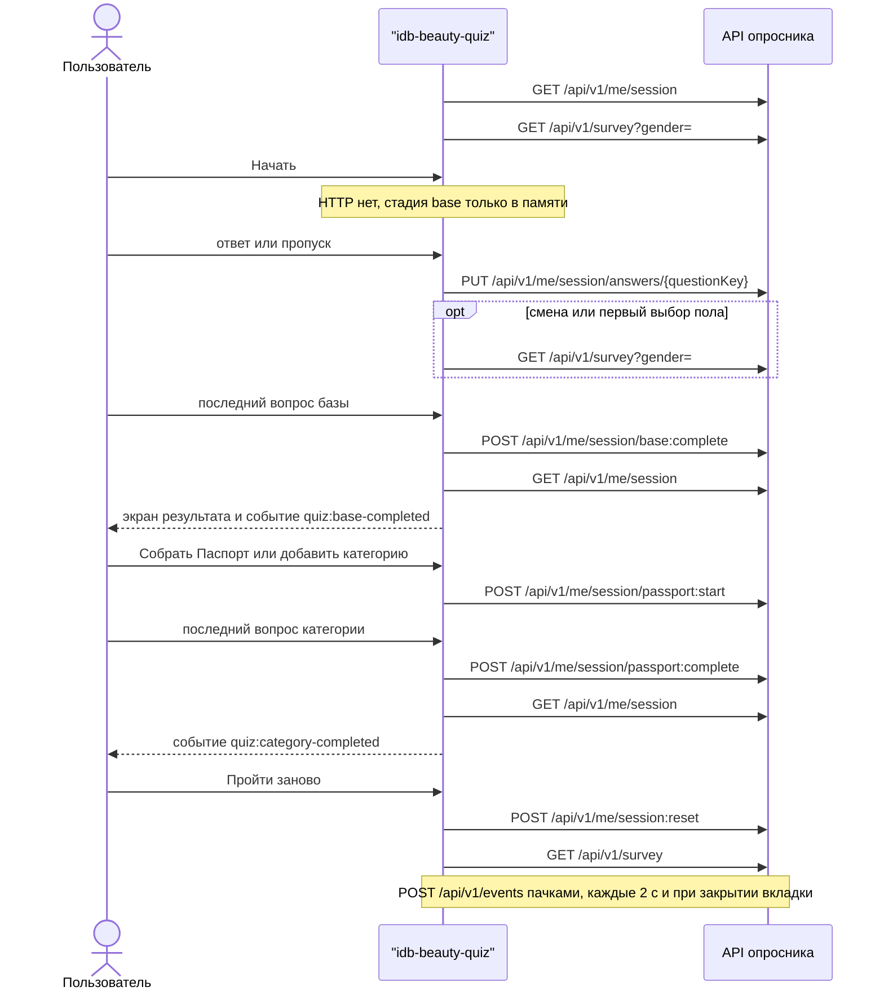
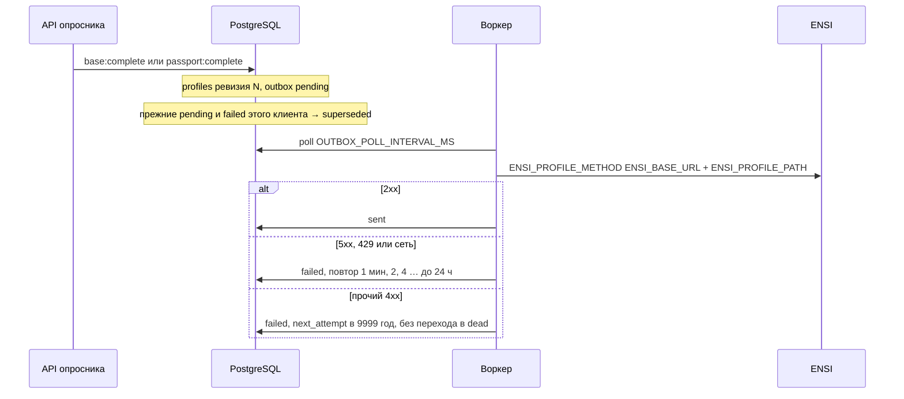
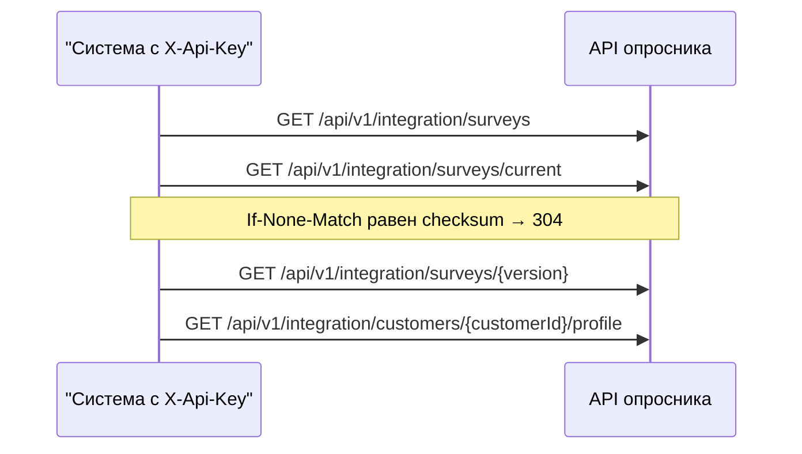
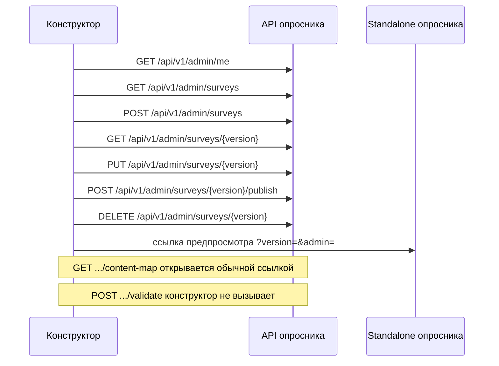

# Методы API

Справочник по маршрутам `apps/api`. Для каждого метода указано, кто его вызывает и в какой момент. Конверт ответа: `{ "data", "meta"?, "errors"?: [{ "code", "message", "meta"? }] }`.

OpenAPI: `GET /api/v1/openapi.json` и Swagger UI `/docs`, если `SWAGGER_ENABLED=true`. В схеме безопасности Swagger объявлены Bearer и `X-Customer-Id`. Заголовки `X-Api-Key` и `X-Admin-Token` в компонентах OpenAPI не описаны; на маршрутах они проверяются.

Как встраивать web-компонент, не вызывая методы сессии, — [`INTEGRATION.md`](INTEGRATION.md).

## Кто с кем говорит

| Контур | Кто вызывает | Авторизация | Зачем |
|---|---|---|---|
| Внутренний | web-компонент `<idb-beauty-quiz>` → свой API | `Authorization: Bearer` (JWT ЛК). На стенде `AUTH_MODE=dev` — `X-Customer-Id` | Сессия, ответы, расчёт, аналитика |
| ЛК | страница кабинета | не HTTP этого сервиса | Встройка и события DOM, см. руководство |
| ENSI, приём | воркер → метод ENSI | `ENSI_AUTH_HEADER` / `ENSI_AUTH_VALUE` | Доставка профиля. Метод реализует команда ENSI |
| Сервисное чтение | любая система с ключом, web-компонент сюда не ходит | `X-Api-Key` = `INTEGRATION_API_KEY` | Забрать опубликованный опросник или профиль без JWT пользователя |
| Конструктор | `apps/admin` | `X-Admin-Token` = `ADMIN_TOKEN` | Черновики и публикация |
| Эксплуатация | оркестратор, Prometheus | нет | health, ready, metrics |

Лимит `RATE_LIMIT_PER_MINUTE` (по умолчанию 60 запросов в минуту) стоит на `PUT /me/session/answers/{questionKey}` и на `POST /events`. Ключ лимита — `customerId`, иначе IP. Остальные методы сессии лимитом маршрута не закрыты. Сервисное чтение ограничено 600 запросами в минуту на IP: у ключа нет `customerId`, поэтому ключ лимитера — адрес клиента. `GET /survey`, health и конструктор лимитом маршрута не закрыты.

## Внутренний контур web-компонента

Страница ЛК эти методы не вызывает. Их вызывает `apps/web/src/api/client.ts` из контроллера `apps/web/src/state/controller.ts`.

Ниже — порядок одного прохода. `GET /me/profile` в этой последовательности нет: компонент его не запрашивает, профиль он получает из `base:complete` и `passport:complete`.



Кнопки «Назад», «Позже» и «Начать» HTTP не вызывают. «Позже» только прячет анонс Паспорта на этом экране и шлёт аналитику `passport_postponed`.

| Метод | Когда вызывает компонент | Ответ |
|---|---|---|
| `GET /api/v1/me/session` | Монтирование. Ещё раз после `base:complete`, после `passport:complete` и если завершение этапа вернуло ошибку | Сессия. Если активной нет — создаётся пустая, стадия `intro` |
| `GET /api/v1/survey` | Сразу после сессии, с полом из `derived.gender`. Повторно после ответа на `gender`, если пол в конфиге другой. После сброса — без пола | Конфиг под пол. Без пола в запросе — только вопрос `gender` |
| `PUT /api/v1/me/session/answers/{questionKey}` | Каждый выбор single, «Далее» на multi и «Пропустить». Запросы идут очередью, по одному | Сессия и `meta.genderReset` |
| `POST /api/v1/me/session/base:complete` | Отвечен последний вопрос базы | `BeautyProfile`. В той же транзакции — ревизия профиля и строка outbox |
| `POST /api/v1/me/session/passport:start` | «Собрать Паспорт» или «добавить категорию», тело `{ "category" }` | Сессия со стадией `passport` |
| `POST /api/v1/me/session/passport:complete` | Отвечен или пропущен каждый вопрос категории, тело `{ "category" }` | `BeautyProfile` и новая ревизия в outbox |
| `POST /api/v1/me/session:reset` | «Пройти заново» | Новая пустая сессия. Старая архивируется. В ENSI ничего не ставится |
| `POST /api/v1/events` | Пачка до 100 событий, debounce 2 с, повтор при `pagehide` и скрытии вкладки (`fetch` с `keepalive`) | `202`, `{ "data": { "accepted" } }` |

`GET /survey` для опубликованной версии идёт без JWT: компонент шлёт только `If-None-Match` и, в предпросмотре черновика, `X-Admin-Token`. Остальные методы таблицы требуют JWT (или `X-Customer-Id` на dev-стенде).

Тело ответа на вопрос:

```json
{ "optionCodes": ["female"], "skipped": false, "timeMs": 1200 }
```

`questionKey` — латиница, цифры и `_`, с буквы. У `single` ровно один код. У `multi` пустой список допустим только вместе с `"skipped": true`.

Сессия в `data`:

```json
{
  "sessionId": "uuid",
  "surveyVersion": "1.0.0",
  "stage": "intro",
  "activeCategory": null,
  "answers": {},
  "derived": {
    "gender": null,
    "baseComplete": false,
    "psychotype": "M",
    "votes": { "E": 0, "P": 0, "L": 0, "M": 0 },
    "primaryCategory": null,
    "completedCategories": [],
    "completenessPct": 0,
    "widgets": { "priority": [], "base": [] }
  }
}
```

Поля `currentQuestionKey` в ответе нет. Текущий вопрос компонент вычисляет сам: первый неотвеченный в очереди стадии. Стадии: `intro`, `base`, `result1`, `passport`, `result2`.

`GET /survey` отдаёт уже выбранные под пол тексты. В вариантах есть `code`, `title`, `subtitle`, `exclusive`, `categoryCode`. Голосов психотипа и тегов там нет, варианты с `deprecated: true` скрыты. `ETag` — хеш тела; `If-None-Match` даёт 304. У опубликованной версии `Cache-Control: public, max-age=300`.

Смена пола на сервере стирает остальные ответы и возвращает `meta.genderReset: true`. Компонент после этого заново запрашивает конфиг.

`SURVEY_VERSION_MISMATCH` (409) — версию, на которой начата сессия, удалили. Публикация новой версии сама по себе сессию не ломает: старые сессии дочитываются на своей версии, новые открываются на опубликованной.

Предпросмотр черновика (только конструктор): query `version` на `GET /me/session`, `POST /me/session:reset` и `GET /survey`. Для черновика нужен `X-Admin-Token`, иначе 403. Standalone передаёт это из URL `?version=&admin=`. В теге `<idb-beauty-quiz>` предпросмотра нет.

### `GET /api/v1/me/profile`

Контур: доступен держателю JWT этого пользователя. Web-компонент не вызывает.

Возвращает последний профиль и состояние доставки:

```json
{
  "data": {
    "profile": null,
    "ensi": {
      "status": "none",
      "revision": null,
      "lastAttemptAt": null,
      "attempts": 0,
      "lastError": null
    }
  }
}
```

`ensi.status`: `none`, `pending`, `sending`, `sent`, `failed`, `superseded`, `dead`. Профиля может не быть — это не 404, `profile` равен `null`.

Тот же профиль по сервисному ключу устроен иначе: профиль лежит в `data`, статус — в `meta.ensi`, отсутствие профиля — 404. См. сервисное чтение ниже.

## Приём профиля в ENSI

Контур: метод реализует команда ENSI, вызывает воркер `apps/worker` (в `pnpm demo` — цикл внутри API). Страница ЛК и web-компонент сюда не ходят.



Шаблон пути по умолчанию в документации адаптера: `/api/v1/customers/{customer_id}/beauty-profile`. Метод по умолчанию `PUT`. Заголовки: авторизация из env, `Idempotency-Key: <customer_id>:<revision>`, `traceparent`. Тело и список того, что нужно от ENSI, — [`ENSI.md`](ENSI.md).

`GET` по `ENSI_FETCH_PATH` реализован в адаптере (`fetchProfile`) и тестами адаптера закрыт. Ни API, ни воркер его не вызывают: при входе компонент читает сессию из базы опросника.

## Сервисное чтение

Контур: внешняя система с `X-Api-Key`. Нужен, чтобы забрать текст опросника или профиль без сессии пользователя. Web-компонент использует `GET /survey` и методы сессии, не этот набор. Пустой `INTEGRATION_API_KEY` выключает весь префикс (403).

Черновики конструктора здесь не отдаются.



| Метод | Когда | Что в `data` |
|---|---|---|
| `GET /api/v1/integration/surveys/current` | Узнать опубликованный опросник целиком | Оба пола, голоса E/P/L/M, ветки, виджеты, тексты. `ETag` = checksum. `meta.version`, `meta.publishedAt`, `meta.checksum`. `Cache-Control: no-cache` |
| `GET /api/v1/integration/surveys` | Список опубликованных и архивных версий | Сводка без поля `issues` и без черновиков |
| `GET /api/v1/integration/surveys/{version}` | Разобрать ответы старой ревизии | Конфиг этой версии. Черновик — 404 |
| `GET /api/v1/integration/customers/{customerId}/profile` | Забрать профиль, если push ещё не разобран или нужен pull | `BeautyProfile` в `data`, `meta.ensi` — статус доставки. Нет профиля — 404 `NOT_FOUND` |

Схема документа — `packages/survey-config/src/schema.ts`, образец — `survey.v1.json`. Это не тот JSON, который отдаёт `GET /survey`: здесь оба пола, голоса, теги и `deprecated`.

Правила, если по этому документу рисуют вопросы сами:

- `single` не пропускается. `multi` с `skippable: true` можно сдать пустым списком.
- `exclusive: true` в multi оставляет выбранным только этот вариант.
- `deprecated: true` не показывать; старый ответ с таким кодом сервер принимает.
- Смена пола сбрасывает остальные ответы.
- Психотип и виджеты считает сервер при `PUT` ответа и при завершении этапа. Локальная копия формул для доставки в ENSI не используется.

Ответы такого фронта всё равно идут во внутренние методы сессии с JWT пользователя. Иначе профиль в очередь ENSI не попадёт.

## Конструктор

Контур: приложение `apps/admin`. В ЛК не встраивается. Пустой `ADMIN_TOKEN` выключает префикс.



| Метод | Когда |
|---|---|
| `GET /api/v1/admin/me` | Вход: проверить токен, `{ "data": { "ok": true } }` |
| `GET /api/v1/admin/surveys` | Список версий, включая черновики и число замечаний |
| `POST /api/v1/admin/surveys` | «Новый черновик». Тело `{ version, fromVersion?, notes? }`. Ответ 201 |
| `GET /api/v1/admin/surveys/{version}` | Открыть редактор. `data.config` и `meta.report` |
| `PUT /api/v1/admin/surveys/{version}` | Автосохранение черновика, тело `{ config }`. Снова `meta.report` |
| `POST /api/v1/admin/surveys/{version}/validate` | Проверка без сохранения. Кнопки в конструкторе нет: отчёт приходит с GET и PUT |
| `POST /api/v1/admin/surveys/{version}/publish` | Публикация при пустом отчёте. Прежняя опубликованная версия становится архивной |
| `DELETE /api/v1/admin/surveys/{version}` | Удалить черновик. Ответ 204 |
| `GET /api/v1/admin/surveys/{version}/content-map` | Markdown карты кодов, `Content-Type: text/markdown` |

Ссылка «Карта контента» в конструкторе — обычный переход по URL. Заголовок `X-Admin-Token` браузер при этом не отправляет, маршрут отвечает 401. Вызов с заголовком (curl, Swagger) карту отдаёт.

Предпросмотр открывает standalone с `version` и `admin` в query. Дальше standalone ходит во внутренние методы сессии от имени случайного `customer=preview-...`.

## Эксплуатация

| Метод | Где | Когда |
|---|---|---|
| `GET /api/v1/health` | оркестратор | Liveness. `{ "data": { "status": "ok", "surveyVersion" } }` |
| `GET /api/v1/ready` | оркестратор | Readiness. 200, если `select 1` к базе прошёл, иначе 503 |
| `GET /metrics` | Prometheus | Корень процесса, не под `/api/v1`. Текст Prometheus |
| `GET /api/v1/openapi.json`, `GET /docs` | разработчик | Только при `SWAGGER_ENABLED=true` |

## Ошибки

| Код | HTTP |
|---|---|
| `UNAUTHORIZED` | 401 |
| `FORBIDDEN` | 403 |
| `VALIDATION_ERROR` | 422 |
| `QUESTION_NOT_FOUND` | 404 |
| `OPTION_NOT_ALLOWED` | 422 |
| `STAGE_NOT_COMPLETE` | 409 |
| `BRANCH_NOT_AVAILABLE` | 422 |
| `SURVEY_VERSION_MISMATCH` | 409 |
| `RATE_LIMITED` | 429 |
| `NOT_FOUND` | 404 |
| `INTERNAL` | 500 |

У 401 в `meta.reason` может быть текст проверки JWT.

## Пример на dev-стенде

`AUTH_MODE=dev`, заголовок вместо JWT. Так стенд и `pnpm demo` принимают пользователя. В production заголовок не работает.

```bash
H='-H X-Customer-Id:demo -H Content-Type:application/json'
curl -s $H localhost:3000/api/v1/me/session | jq .data.stage
curl -s $H -X PUT localhost:3000/api/v1/me/session/answers/gender -d '{"optionCodes":["female"]}' | jq .data.derived
for k in psycho1:E psycho2:E psycho3:P category:face; do
  curl -s $H -X PUT localhost:3000/api/v1/me/session/answers/${k%%:*} -d "{\"optionCodes\":[\"${k##*:}\"]}" > /dev/null
done
curl -s $H -X POST localhost:3000/api/v1/me/session/base:complete | jq '.data | {psychotype, completeness_pct, widgets}'
curl -s $H localhost:3000/api/v1/me/profile | jq .data.ensi
```
