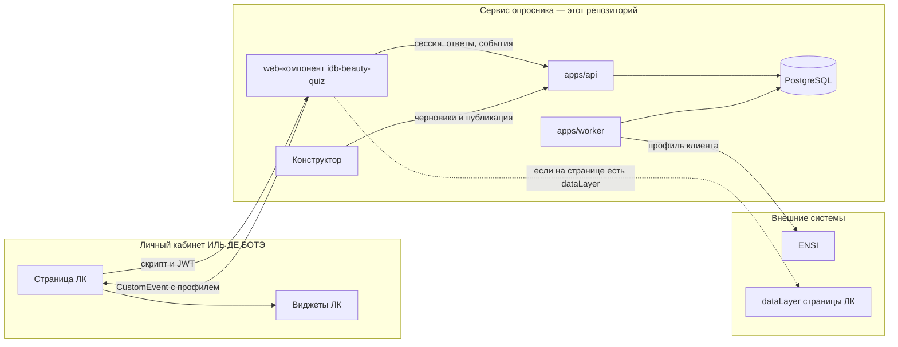

# Архитектура и размещение

Актуальная картина по коду репозитория. Исходное задание — [`TZ.md`](TZ.md) (там есть расхождения с тем, что собрано). Журнал решений — [`DECISIONS.md`](DECISIONS.md).

Опросник — отдельный сервис со своим API, базой и web-компонентом. Личный кабинет встраивает web-компонент. ENSI — внешняя система: она не рисует опросник и не хранит сессию. Воркер этого сервиса отдаёт ей готовый профиль.

## Из чего состоит сервис

Всё ниже — один репозиторий. Отдельного пакета web-компонента и отдельного репозитория бэкенда нет.

| Часть | Каталог | Что делает | Куда ставится |
|---|---|---|---|
| Web-компонент `<idb-beauty-quiz>` | `apps/web`, сборка `dist/embed/idb-beauty-quiz.js` и `idb-beauty-quiz.iife.js` | Готовый опросник. Сам вызывает API сессии | Статика (nginx). В Docker Compose — порт 8080, файлы лежат рядом со standalone-страницей |
| Standalone-страница | `apps/web`, `dist/index.html` | Тот же опросник на весь экран: эталон и предпросмотр черновика | Та же статика |
| Конструктор | `apps/admin` | Версии опросника для продакта | Отдельная статика (Compose: порт 8081). В ЛК не встраивается |
| API | `apps/api` | Сессии, расчёт профиля, отдача конфига, админ- и сервисный API | Процесс Node, порт 3000. Stateless, можно несколько реплик |
| Воркер доставки | `apps/worker` | Забирает очередь `ensi_outbox` и вызывает ENSI | Отдельный процесс. В режиме `pnpm demo` (PGlite) тот же цикл крутится внутри API |
| База | PostgreSQL 16 | Сессии, ответы, профили, очередь, версии опросника | Рядом с API. PGlite — только демо, тесты и локальный запуск без Docker |
| Движок | `packages/core` | Психотип, заполненность, виджеты, профиль | Библиотека внутри API. Страница опросника результат с сервера не пересчитывает |
| ENSI | вне репозитория | Принимает профиль клиента | Внешний HTTP. Пока контракт не подключён, адаптер пишет JSON в файл (`ENSI_SINK=file`) |

Контент опубликованной версии лежит в таблице `survey_versions`. Файл `packages/survey-config/survey.v1.json` — сид первой версии и фикстура тестов, не источник, который ЛК читает в рантайме.

## Диаграмма компонентов

Стрелка «сессия, ответы, события» — внутренний контур web-компонента. Методы этого контура перечислены в [`API.md`](API.md). Страница ЛК по ним не ходит. Что делает команда ЛК — в [`INTEGRATION.md`](INTEGRATION.md).

## Два разных JSON профиля

Их легко смешать: имена похожи, получатели разные.

| Куда | Когда | Форма |
|---|---|---|
| Событие DOM `quiz:base-completed` / `quiz:category-completed` | Web-компонент только что завершил этап | `BeautyProfile` из `packages/core`: `widgets.priority`, `widgets.base`, `psychotype.code`, `completeness_pct` |
| HTTP в ENSI | Воркер доставил ревизию | `toEnsiPayload`: плоские `attributes.beauty_*` и вложенный `beauty_profile` с тем же `BeautyProfile` |

ЛК для перестроения своих виджетов берёт `detail.widgets` из события. Плоские `attributes` нужны только приёмной стороне ENSI.

## Где это может жить

Код не выбирает юрлицо, которое держит production. Он задаёт форму поставки.

Сервис самодостаточный: API, воркер, PostgreSQL, статика web-компонента, конструктор. В нём нет адреса поставщика, биллинга и панели «чужого» SaaS. Пример встройки в [`RUNBOOK.md`](RUNBOOK.md) указывает на `https://quiz.iledebeaute.ru` — домен ИЛЬ ДЕ БОТЭ, не внешний стенд. ENSI в коде всегда снаружи: до него ходит только воркер, URL задаётся `ENSI_BASE_URL`.

Из этого следуют два рабочих варианта. Какой из них договорный — открытый вопрос, см. [`analyst-response.md`](analyst-response.md).

**Вариант A. Сервис в инфраструктуре ИЛЬ ДЕ БОТЭ.** Команда получает этот репозиторий и поднимает API, воркер, PostgreSQL и статику. В тег передаётся свой `api-base`. JWT пользователей ЛК проверяется по JWKS или PEM (`AUTH_MODE=jwt`). Так устроены Docker Compose, `.env.example` и runbook.

**Вариант B. Сервис снаружи, у ЛК только страница.** Тот же web-компонент грузится с чужого origin, `api-base` указывает туда, в `CORS_ORIGINS` сервиса внесены origin-ы ЛК. Репозиторий для встройки страницы не обязателен. Код это допускает (атрибут `api-base`, CORS, JWT), но отдельного внешнего контура в репозитории нет: его нужно явно выбрать и собрать.

В обоих вариантах ENSI остаётся внешней системой. Очередь и расчёт профиля живут в сервисе опросника.

Демо без PostgreSQL (`pnpm demo`, каталог `./.pgdata`) — один процесс со встроенной PGlite. Для production нужен PostgreSQL: PGlite однопроцессная, воркер в этом режиме не выносится отдельно.
