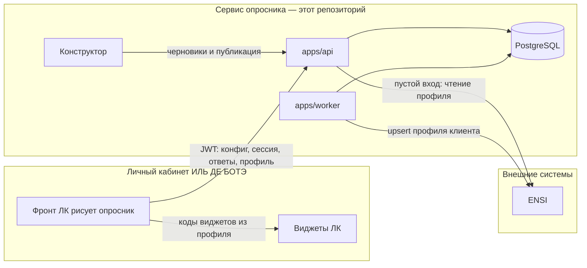

# Архитектура и размещение

Актуальная картина по коду репозитория. Исходное задание — [`TZ.md`](TZ.md) (там есть расхождения с тем, что собрано). Журнал решений — [`DECISIONS.md`](DECISIONS.md).

Опросник — отдельный сервис со своим API и базой. Фронт личного кабинета сам рисует опросник и вызывает этот API с JWT пользователя. Интеграция только по API. ENSI — внешняя система: она не рисует опросник и не хранит сессию. Воркер этого сервиса отдаёт ей готовый профиль.

## Из чего состоит сервис

Бэкенд и весь код сервиса — этот репозиторий, `pomazkoff/idb-beauty-passport`. Отдельного репозитория бэкенда нет.

| Часть | Каталог | Что делает | Куда ставится |
|---|---|---|---|
| Предпросмотр черновика | `apps/web` | Страница для конструктора: посмотреть опросник до публикации | Статика (nginx). В Docker Compose — порт 8080 |
| Конструктор | `apps/admin` | Версии опросника для продакта | Отдельная статика (Compose: порт 8081). В страницу ЛК не входит |
| API | `apps/api` | Сессии, расчёт профиля, отдача конфига, админ- и сервисный API | Процесс Node, порт 3000. Stateless, можно несколько реплик |
| Воркер доставки | `apps/worker` | Забирает очередь `ensi_outbox` и вызывает ENSI | Отдельный процесс. В режиме `pnpm demo` (PGlite) тот же цикл крутится внутри API |
| База | PostgreSQL 16 | Сессии, ответы, профили, очередь, версии опросника | Рядом с API. PGlite — только демо, тесты и локальный запуск без Docker |
| Движок | `packages/core` | Психотип, заполненность, виджеты, профиль | Библиотека внутри API. Страница опросника результат с сервера не пересчитывает |
| ENSI | вне репозитория | Хранит один профиль на клиента. Контракт приёма принадлежит ENSI | Внешний HTTP. API читает профиль при пустом входе, воркер обновляет его через upsert. Пока контракт не передан, адаптер пишет JSON в файл (`ENSI_SINK=file`) |

Контент опубликованной версии лежит в таблице `survey_versions`. Так продакт публикует опросник из конструктора без выкладки кода. Опубликованная версия одна. Сессия дочитывается на той версии, на которой начата. Фронт ЛК забирает её через `GET /api/v1/survey`, другие системы — через `GET /api/v1/integration/surveys/current`. Файл `packages/survey-config/survey.v1.json` — сид первой версии и фикстура тестов, не источник, который ЛК читает в рантайме.

## Диаграмма компонентов

Стрелка «конфиг, сессия, ответы, профиль» — контракт фронта ЛК. Методы перечислены в [`INTEGRATION.md`](INTEGRATION.md) и [`API.md`](API.md).

## Два разных JSON профиля

Их легко смешать: имена похожи, получатели разные.

| Куда | Когда | Форма |
|---|---|---|
| Ответ `base:complete`, `passport:complete` и `GET /me/profile` | Фронт ЛК завершил этап или читает коды виджетов | `BeautyProfile` из `packages/core`: `widgets.priority`, `widgets.base`, `psychotype.code`, `completeness_pct` |
| HTTP в ENSI | Воркер доставил ревизию | `toEnsiPayload`: плоские `attributes.beauty_*` и вложенный `beauty_profile` с тем же `BeautyProfile` |

Фронт ЛК для блоков кабинета берёт `widgets` из ответа API. Плоские `attributes` нужны только приёмной стороне ENSI.

## Где это работает

Production опросника работает в инфраструктуре ИЛЬ ДЕ БОТЭ. Репозиторий передаётся, когда аналитик принимает сервис.

| Что | Адрес |
|---|---|
| API, его вызывает фронт ЛК | `https://beauty-api.iledebeaute.ru` |
| Статика предпросмотра черновика | `https://beauty-quiz.iledebeaute.ru` |

ИЛЬ ДЕ БОТЭ поднимает API, воркер и PostgreSQL. Фронт ЛК ходит на `https://beauty-api.iledebeaute.ru` с JWT пользователя. JWT выпускает backend личного кабинета; сервис опросника только проверяет подпись (RS256, JWKS или PEM), `iss`, `aud` и читает id клиента из клейма. Этот id совпадает с id клиента в ENSI. Конкретные ключ, `iss`, `aud` и имя клейма передаёт команда ЛК — см. [`INTEGRATION.md`](INTEGRATION.md).

Контракт приёма профиля принадлежит ENSI: URL, метод, авторизация и идемпотентность. Пока команда ENSI их не передала, доставка идёт в файл (`ENSI_SINK=file`). ENSI остаётся внешней системой. При пустом входе залогиненного клиента API читает оттуда уже сохранённый профиль. У клиента один профиль: воркер обновляет его через `upsertProfile`, повторное прохождение второй профиль не создаёт. Подтверждено: id клиента в JWT равен id клиента в ENSI.

Локальная разработка и Docker Compose слушают `localhost`. Это адреса стенда разработчика, не production.

В production `CORS_ORIGINS` включает origin страницы ЛК, с которой фронт вызывает API. Если предпросмотр черновика открыт с `https://beauty-quiz.iledebeaute.ru`, этот origin тоже входит в список.

Демо без PostgreSQL (`pnpm demo`, каталог `./.pgdata`) — один процесс со встроенной PGlite. Для production нужен PostgreSQL: PGlite однопроцессная, воркер в этом режиме не выносится отдельно.
