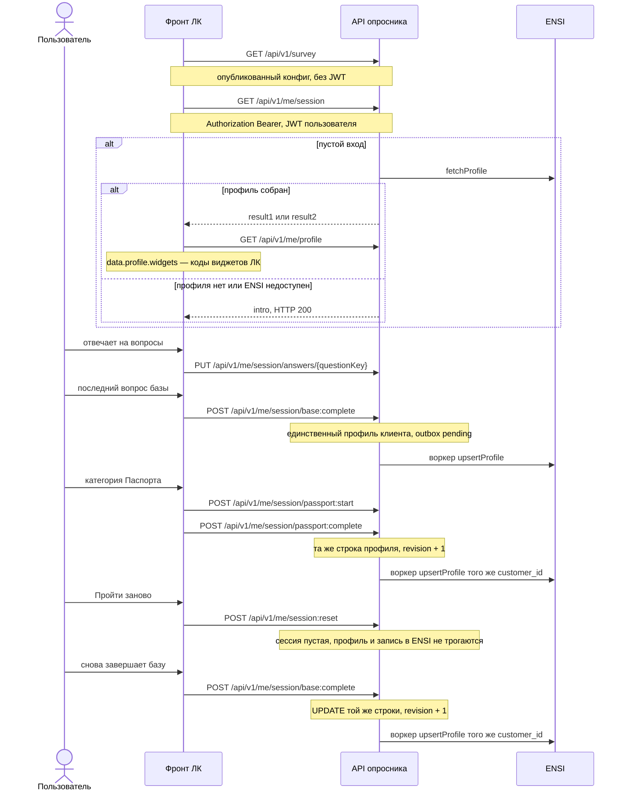

# Руководство по интеграции

Документ для команды личного кабинета ИЛЬ ДЕ БОТЭ. В этой задаче фронт личного кабинета сам рисует опросник и вызывает API сервиса. Готовый web-компонент `<idb-beauty-quiz>` — необязательная эталонная реализация тех же вызовов, встраивать его не требуется.

Где крутится сервис — [`ARCHITECTURE.md`](ARCHITECTURE.md). Полный перечень методов — [`API.md`](API.md). Доставка профиля в ENSI — [`ENSI.md`](ENSI.md).

Базовый URL API: `https://beauty-api.iledebeaute.ru`. Префикс методов: `/api/v1`.

## Что делает фронт ЛК

1. Берёт опубликованный конфиг: `GET /api/v1/survey`.
2. Открывает или продолжает сессию: `GET /api/v1/me/session` с JWT пользователя.
3. Сохраняет каждый ответ: `PUT /api/v1/me/session/answers/{questionKey}`.
4. Завершает базу: `POST /api/v1/me/session/base:complete`.
5. Для Паспорта: `POST /api/v1/me/session/passport:start`, ответы, `POST /api/v1/me/session/passport:complete`.
6. Для виджетов кабинета читает коды: `GET /api/v1/me/profile` (`data.profile.widgets`).
7. «Пройти заново»: `POST /api/v1/me/session:reset`. Следующее завершение обновляет тот же профиль.
8. События аналитики: `POST /api/v1/events`.

Психотип, заполненность и коды виджетов считает сервер. Фронт их показывает, а не пересчитывает.



Направление этих методов: фронт ЛК → API опросника. Это не вызовы ENSI к опроснику. ENSI получает профиль от воркера и может забрать его pull-методом, см. ниже.

## Авторизация

Сервис принимает только токены авторизации пользователей ИЛЬ ДЕ БОТЭ. Своих пользователей не заводит, токен не выпускает и анонимный вход не открывает. В production запрос сессии без `Authorization: Bearer` отвечает 401.

JWT выпускает backend личного кабинета. Сервис проверяет его так (`apps/api/src/plugins/auth.ts`, `AUTH_MODE=jwt`):

1. Заголовок `Authorization` начинается с `Bearer `.
2. Подпись проверяется алгоритмом RS256. Ключ — JWKS (`JWT_JWKS_URL`) или PEM публичного ключа (`JWT_PUBLIC_KEY_PEM`, `importSPKI` с алгоритмом RS256). Для JWKS берётся алгоритм ключа в наборе; выпускать токен нужно тем же RS256.
3. Проверяются `iss` (`JWT_ISSUER`), `aud` (`JWT_AUDIENCE`) и срок `exp`.
4. Id клиента читается из клейма `JWT_CUSTOMER_CLAIM`. Если имя не задано, читается `sub`. Значение должно быть строкой или числом.

Подтверждено владельцем: значение этого клейма — id клиента, и оно равно id клиента в ENSI. Сервис записывает его в сессию как `customer_id` и тем же значением обновляет профиль в ENSI. Отдельного сопоставления идентификаторов нет.

Команда ЛК передаёт:

| Параметр сервиса | Что прислать |
|---|---|
| `JWT_JWKS_URL` или `JWT_PUBLIC_KEY_PEM` | адрес набора ключей либо PEM публичного ключа |
| `JWT_ISSUER`, `JWT_AUDIENCE` | `iss` и `aud` токена ЛК |
| `JWT_CUSTOMER_CLAIM` | имя клейма с id клиента. Если имя не передано, сервис читает `sub` |

`X-Admin-Token` фронт ЛК не передаёт. Он нужен конструктору. На `GET /api/v1/me/session` и `POST /api/v1/me/session:reset` query `version` — предпросмотр черновика: без `X-Admin-Token` это 403. Фронт ЛК этот query не добавляет.

Заголовок `X-Customer-Id` и query `?customer=` в этом руководстве не используются. Они есть только в `AUTH_MODE=dev` на стенде разработчика. При `NODE_ENV=production` такой режим не стартует. Подробности стенда — [`RUNBOOK.md`](RUNBOOK.md).

В production `CORS_ORIGINS` включает origin страницы ЛК, с которой фронт вызывает API. Если рядом поднимают эталонную страницу, в список входит и `https://beauty-quiz.iledebeaute.ru`. Пустой список выключает CORS. Локальные `http://localhost:*` в `.env.example` и Docker Compose — стенд разработчика.

## Конфиг опросника

`GET /api/v1/survey?gender=female|male`

Опубликованная версия отдаётся без JWT. В ответе тексты уже выбраны под один пол: вопросы базы и ветки Паспорта. В вариантах есть `code`, `title`, `subtitle`, `exclusive`, `categoryCode`. Голосов психотипа и тегов там нет, варианты с `deprecated: true` скрыты. Без `gender` в ответе только вопрос `gender`.

`ETag` — хеш тела. `If-None-Match` даёт 304. У опубликованной версии `Cache-Control: public, max-age=300`.

Полный документ с обоими полами, голосами и тегами — сервисное чтение `GET /api/v1/integration/surveys/current` (заголовок `X-Api-Key`). Фронту ЛК для экрана опросника он не нужен: хватает `GET /survey`.

Правила экрана:

- `single` не пропускается. У него ровно один код.
- `multi` с `skippable: true` можно сдать пустым списком только вместе с `"skipped": true`.
- `exclusive: true` в multi оставляет выбранным только этот вариант.
- Смена пола на сервере стирает остальные ответы. В ответе `PUT` будет `meta.genderReset: true`, после этого конфиг запрашивают заново.
- Текущий вопрос фронт находит сам: первый неотвеченный в очереди стадии. Поля `currentQuestionKey` в сессии нет.

## Сессия и ответы

Все методы ниже требуют `Authorization: Bearer <JWT пользователя>`.

| Метод | Когда | Ответ |
|---|---|---|
| `GET /api/v1/me/session` | Открытие опросника и после завершения этапа | Сессия. Пустой вход читает профиль из ENSI |
| `PUT /api/v1/me/session/answers/{questionKey}` | Каждый выбор и «Пропустить» | Сессия и `meta.genderReset` |
| `POST /api/v1/me/session/base:complete` | Отвечен последний вопрос базы | `BeautyProfile`, в очередь ENSI |
| `POST /api/v1/me/session/passport:start` | Старт категории, тело `{ "category" }` | Сессия, стадия `passport` |
| `POST /api/v1/me/session/passport:complete` | Отвечена категория, тело `{ "category" }` | `BeautyProfile`, в очередь ENSI |
| `POST /api/v1/me/session:reset` | «Пройти заново» | Пустая сессия. Профиль не удаляется и в ENSI не уходит |
| `GET /api/v1/me/profile` | Коды виджетов и статус доставки | `{ profile, ensi }`. Профиля может не быть: `profile: null`, HTTP 200 |
| `POST /api/v1/events` | Пакет аналитики, до 100 событий | `202`, `{ "data": { "accepted" } }` |

`questionKey` — латиница, цифры и `_`, с буквы. Лимит `RATE_LIMIT_PER_MINUTE` (по умолчанию 60 в минуту) стоит на `PUT` ответов и на `POST /events`. Ключ лимита — id клиента.

Тело `PUT` — один ответ, не пустой объект:

```json
{ "optionCodes": ["female"], "skipped": false, "timeMs": 1200 }
```

`timeMs` можно не передавать. `skipped` по умолчанию `false`.

В сессии `data.answers` — объект, ключ которого равен `question_key`. У каждого ключа одна и та же форма:

```json
{
  "sessionId": "3f1c2a40-7b2e-4c1a-9d0e-6a1b2c3d4e5f",
  "surveyVersion": "1.0.0",
  "stage": "base",
  "activeCategory": null,
  "answers": {
    "gender": {
      "optionCodes": ["female"],
      "skipped": false,
      "timeMs": 1200,
      "answeredAt": "2026-10-08T12:00:00.000Z"
    }
  },
  "derived": {
    "gender": "female",
    "baseComplete": false,
    "psychotype": "M",
    "votes": { "E": 0, "P": 0, "L": 0, "M": 0 },
    "primaryCategory": null,
    "completedCategories": [],
    "completenessPct": 0,
    "widgets": { "priority": [], "base": [] }
  }
}
```

Поля одного сохранённого ответа: `optionCodes` (массив кодов), `skipped` (boolean), `timeMs` (необязательное число миллисекунд), `answeredAt` (ISO-8601, момент сохранения на сервере). Пустой `optionCodes` допустим только при `skipped: true`. Та же форма описана в OpenAPI (`GET /api/v1/openapi.json`): схема ответа сессии не является пустым объектом.

Стадии: `intro`, `base`, `result1`, `passport`, `result2`.

Пустой вход (`stage=intro`, база не завершена, ответов нет, это не предпросмотр и не сессия сразу после reset) вызывает `fetchProfile` в ENSI. Если профиль собирается, сессия открывается на `result1` или `result2`. Нет профиля, 404 и пустой file-sink оставляют `intro` и больше не спрашивают ENSI на этой сессии. Сеть и 5xx тоже оставляют `intro`, чтение повторяется при следующем `GET /me/session`. Ошибка ENSI не превращает открытие в 500. Уже начатую сессию импорт не затирает. Импортированный профиль в очередь повторной отправки не ставится.

`SURVEY_VERSION_MISMATCH` (409) — версию, на которой начата сессия, удалили. Публикация новой версии сама по себе сессию не ломает.

## Профиль и виджеты ЛК

`BeautyProfile` приходит в `data` ответов `base:complete` и `passport:complete` и в `data.profile` у `GET /api/v1/me/profile`.

Поля, все:

| Поле | Смысл |
|---|---|
| `schema_version` | всегда `"1.0"` |
| `customer_id` | id клиента, тот же, что в JWT и в ENSI |
| `profile_revision` | номер ревизии единственного профиля |
| `survey_version` | версия опросника, на которой собран профиль |
| `updated_at` | ISO-8601 |
| `gender` | `female` или `male` |
| `psychotype.code` | `E`, `P`, `L` или `M` |
| `psychotype.name` | название психотипа |
| `psychotype.votes.E` | число голосов |
| `psychotype.votes.P` | число голосов |
| `psychotype.votes.L` | число голосов |
| `psychotype.votes.M` | число голосов |
| `primary_category` | код категории или `null` |
| `completed_categories` | массив кодов завершённых категорий |
| `completeness_pct` | число 0–100 |
| `widgets.priority` | массив кодов приоритетных виджетов ЛК |
| `widgets.base` | массив кодов базовых виджетов ЛК |
| `answers` | массив ответов профиля, см. ниже |
| `traits` | объект: ключ `категория.тема`, значение — массив кодов |
| `tags` | массив строк-тегов |

Элемент `answers[]`: `stage` (`base` или `passport`), `category` (необязательно, код категории), `question_key`, `option_codes`, `skipped`, `answered_at` (необязательно, ISO-8601).

Для виджетов кабинета фронт берёт `widgets.priority` и `widgets.base`. Это коды виджетов ЛК, например `news_blog`.

`GET /api/v1/me/profile` дополнительно отдаёт статус доставки этого профиля в ENSI:

```json
{
  "data": {
    "profile": null,
    "ensi": {
      "status": "none",
      "revision": null,
      "lastAttemptAt": null,
      "attempts": 0,
      "lastError": null
    }
  }
}
```

`data.ensi.status`: `none`, `pending`, `sending`, `sent`, `failed`, `superseded`, `dead`. Это статус отправки профиля красоты в ENSI, не статус HTTP и не доставка контента опросника пользователю. Пока профиля нет, `profile` равен `null` и статус `none`.

Тот же профиль по сервисному ключу устроен иначе: `BeautyProfile` лежит в `data`, статус — в `meta.ensi.status`, отсутствие профиля — 404. Это pull для других систем, не для экрана опросника. См. [`API.md`](API.md).

## Когда профиль уходит в ENSI

Воркер ставит доставку в очередь в той же транзакции, что и запись профиля. Момент один: успешное завершение этапа на сервере.

| Событие | Очередь ENSI |
|---|---|
| `POST /api/v1/me/session/base:complete` | да, pending |
| `POST /api/v1/me/session/passport:complete` (каждая завершённая категория, в том числе добавленная позже) | да, pending, та же строка профиля, `profile_revision` + 1 |
| Завершение базы или категории после «Пройти заново» | да, та же строка, не второй профиль |
| `PUT` отдельного ответа | нет |
| `POST /api/v1/me/session:reset` | нет |
| Открытие сессии и импорт из ENSI | нет, импорт пишется как уже `sent` |

Прежние `pending` и `failed` этого клиента помечаются `superseded`. Воркер вызывает `upsertProfile` для того же `customer_id`. Тело, заголовки и повтор — [`ENSI.md`](ENSI.md).

Второго канала наружу сейчас нет. Webhook в ENSI не реализован: это возможный вариант на будущее, в коде его нет. Забрать профиль самой может система с ключом: `GET /api/v1/integration/customers/{customerId}/profile`, заголовок `X-Api-Key`. Значение ключа — env `INTEGRATION_API_KEY`. В OpenAPI схема называется `X-Api-Key`, параметр заголовка тоже `X-Api-Key`.

## Зависимость: контракт ENSI

Контракт приёма профиля принадлежит ENSI. Нужны URL, HTTP-метод, авторизация сервис-сервис и правило идемпотентности. Пока команда ENSI их не передала, доставка идёт в файл (`ENSI_SINK=file`). Переключение на HTTP — `ENSI_SINK=http` и переменные из [`ENSI.md`](ENSI.md).

Тот же контракт задаёт чтение: при пустом входе API вызывает `fetchProfile` (`GET` по `ENSI_FETCH_PATH`).

У клиента один профиль красоты. Он хранится в базе сервиса и в ENSI. Повторное прохождение обновляет эту запись.

## Эталонный web-компонент

Необязателен. Фронт ЛК его не встраивает.

`<idb-beauty-quiz>` в `apps/web` — эталон тех же вызовов: конфиг, сессия, ответы, завершение, профиль, события. Сборка: `pnpm --filter @idb/web build`, файлы `apps/web/dist/embed/idb-beauty-quiz.js` и `idb-beauty-quiz.iife.js`. Статика эталона — `https://beauty-quiz.iledebeaute.ru`. Если компонент всё же подключают, он шлёт тот же `Authorization: Bearer` из атрибута `token` и наружу кидает `quiz:base-completed`, `quiz:category-completed`, `quiz:closed`, `quiz:analytics`. Для задачи интеграции ЛК контракт — методы этого документа, не тег компонента.
