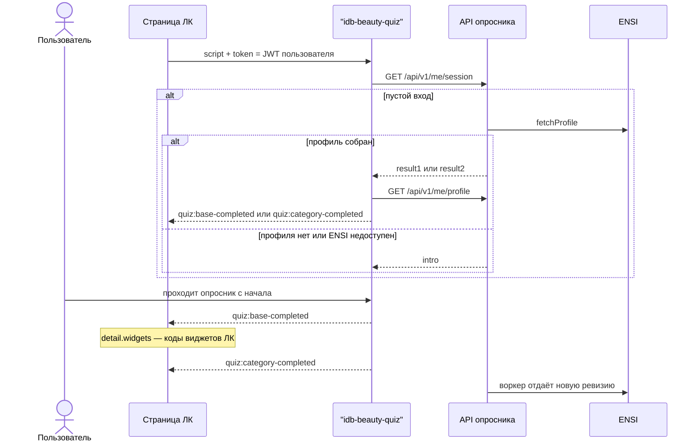
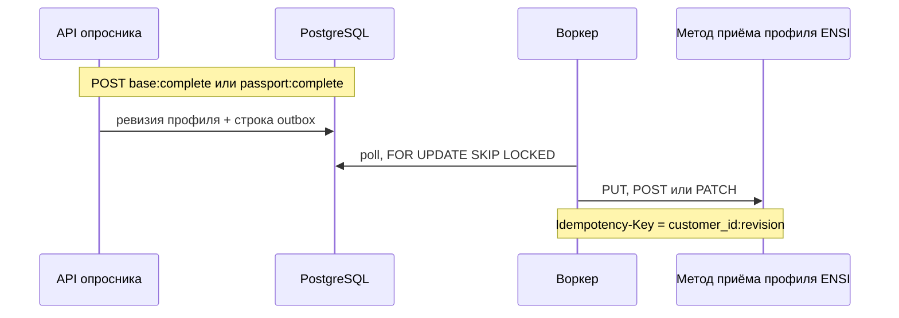

# Руководство по интеграции

Документ для команды личного кабинета ИЛЬ ДЕ БОТЭ. Здесь только то, что встраивается в страницу ЛК, и тот HTTP-метод, который должна принять ENSI.

Опросник поставляется готовым web-компонентом `<idb-beauty-quiz>`. Компонент сам вызывает backend опросника: конфиг, сессию, ответы, аналитику. Эти методы в страницу ЛК не переносятся. Полный перечень с пометкой «внутренний / внешний» и диаграммы по каждому методу — [`API.md`](API.md). Где крутится сервис — [`ARCHITECTURE.md`](ARCHITECTURE.md).

## Что делает страница ЛК

1. Подключает скрипт web-компонента.
2. Передаёт в атрибут `token` JWT текущего пользователя ЛК.
3. Слушает события компонента и по ним обновляет виджеты кабинета.
4. Согласует с командой сервиса параметры проверки этого JWT и origin страницы.

Отдельный вызов методов опросника со стороны ЛК для этого сценария не нужен.



Блок `W->>API` раскрыт в [`API.md`](API.md): кто вызывает каждый метод и на каком шаге. Страница ЛК этих запросов не видит.

## Встройка

Скрипт отдаёт `https://beauty-quiz.iledebeaute.ru`, API — `https://beauty-api.iledebeaute.ru`.

```html
<script type="module" src="https://beauty-quiz.iledebeaute.ru/embed/idb-beauty-quiz.js"></script>
<idb-beauty-quiz
  api-base="https://beauty-api.iledebeaute.ru"
  token="JWT пользователя ЛК"
></idb-beauty-quiz>
```

Файл собирается командой `pnpm --filter @idb/web build`:

| Файл | Как подключать |
|---|---|
| `apps/web/dist/embed/idb-beauty-quiz.js` | `<script type="module">` |
| `apps/web/dist/embed/idb-beauty-quiz.iife.js` | обычный `<script>`, глобальное имя `IdbBeautyQuiz` |

Компонент регистрируется сам (`customElements.define`). Shadow DOM, стили внутри. npm-пакет не публикуется (`private: true`).

### Атрибуты

| Атрибут | Обязательность | Смысл |
|---|---|---|
| `api-base` | да | Origin API опросника, без `/api/v1` на конце |
| `token` | да в production | JWT пользователя. Компонент шлёт `Authorization: Bearer` |
| `customer-id` | только стенд `AUTH_MODE=dev` | Заголовок `X-Customer-Id`. В `NODE_ENV=production` такой режим не стартует |
| `inherit-fonts` | нет | Шрифты страницы ЛК |
| `no-fonts` | нет | Не добавлять на страницу ссылку на Google Fonts |

Атрибута темы нет. Отдельного параметра «какой опросник показать» нет: компонент берёт опубликованную версию.

### События на страницу ЛК

События всплывают из shadow DOM (`bubbles`, `composed`). Слушать можно на `document`.

| Событие | Когда | `detail` |
|---|---|---|
| `quiz:base-completed` | Пользователь закончил 5 базовых вопросов, либо при открытии восстановлен результат базы | `BeautyProfile` |
| `quiz:category-completed` | Пользователь закончил категорию Паспорта, либо при открытии восстановлен Паспорт | `BeautyProfile` |
| `quiz:closed` | Компонент снят со страницы | нет |
| `quiz:analytics` | Каждое событие аналитики, параллельно с батчем на сервер | `{ name, params, ts }` |

`BeautyProfile` — ответ сервера опросника, не тело запроса в ENSI. Для кабинета достаточно кодов виджетов:

```js
document.addEventListener("quiz:base-completed", (e) => {
  const { priority, base } = e.detail.widgets;
  // priority и base — массивы кодов виджетов ЛК, например "news_blog"
});
```

Остальные поля `detail`, если кабинет захочет их показать сам: `psychotype.code`, `psychotype.name`, `primary_category`, `completed_categories`, `completeness_pct`, `gender`, `profile_revision`, `survey_version`.

Если на странице уже есть `window.dataLayer` (массив), компонент пушит туда `{ event: name, ...params }`. Создавать `dataLayer` ради опросника не требуется. Дублировать события вызовом `POST /api/v1/events` со стороны ЛК не нужно: это делает компонент.

### JWT — требование к команде ЛК

JWT выпускает backend личного кабинета. Сервис опросника своих пользователей не заводит и токен не подписывает: он только проверяет подпись, `iss`, `aud`, срок и читает id клиента.

Алгоритм проверки — **RS256**. Ключ — JWKS (`JWT_JWKS_URL`) или PEM публичного ключа (`JWT_PUBLIC_KEY_PEM`, `importSPKI` с RS256). Для JWKS берётся алгоритм ключа в наборе; выпускать токен нужно тем же RS256.

Команда ЛК передаёт:

| Параметр сервиса | Что прислать |
|---|---|
| `JWT_JWKS_URL` или `JWT_PUBLIC_KEY_PEM` | адрес набора ключей либо PEM публичного ключа |
| `JWT_ISSUER`, `JWT_AUDIENCE` | `iss` и `aud` токена ЛК |
| `JWT_CUSTOMER_CLAIM` | имя клейма с id клиента. Если имя не передано, сервис читает `sub` |

Значение клейма — id клиента. Оно записывается в сессию как `customer_id` и уходит в ENSI тем же значением. Клейм обязан совпадать с id клиента в ENSI.

В production `CORS_ORIGINS` включает `https://beauty-quiz.iledebeaute.ru`. Если виджет встроен на странице другого origin, в список добавляется и origin этой страницы. Пустой список выключает CORS. Локальные `http://localhost:*` в `.env.example` и Docker Compose — стенд разработчика.

## Зависимость: контракт ENSI

Контракт приёма профиля принадлежит ENSI. Это зависимость сервиса опросника, не страница ЛК и не web-компонент.

Нужны URL, HTTP-метод, авторизация сервис-сервис и правило идемпотентности. Пока команда ENSI их не передала, доставка идёт в файл (`ENSI_SINK=file`). Переключение на HTTP — `ENSI_SINK=http` и переменные из [`ENSI.md`](ENSI.md).

Тот же контракт задаёт чтение: при пустом входе API вызывает `fetchProfile` (`GET` по `ENSI_FETCH_PATH`). Ответ 404 и отсутствующий файл file-sink открывают опросник с начала и больше не спрашивают ENSI на этой сессии. Сетевая ошибка и 5xx тоже открывают опросник с начала, чтение повторяется при следующем входе. Импортированный профиль в очередь повторной отправки не ставится.



Метод, путь и заголовок авторизации задаются окружением (`ENSI_PROFILE_METHOD`, `ENSI_PROFILE_PATH`, `ENSI_AUTH_HEADER`). В репозитории нет зафиксированного URL ENSI. Тело — объект с `customer_id`, `attributes` и `beauty_profile`, пример в [`ENSI.md`](ENSI.md).

Успешный ответ — 2xx. Поле `data.id`, если оно есть, сохраняется как внешний id. 5xx, 429 и сеть — повтор с паузой 1 мин, 2, 4 … до 24 ч; после `OUTBOX_MAX_ATTEMPTS` строка становится `dead`. Прочий 4xx остаётся `failed` и больше не берётся в работу, пока ревизию не поставят в очередь вручную (`pnpm ensi:resync -- --customer <id>`).

`POST /me/session:reset` («Пройти заново») профиль в ENSI не отправляет и сохранённый профиль заново не подмешивает: новая сессия пустая. Новая ревизия уходит после следующего завершения базы или категории.

## Чего от ЛК в этом сценарии нет

- Реализовывать методы сессии, конфига и аналитики.
- Забирать опросник по `X-Api-Key` и рисовать вопросы своими компонентами.
- Считать психотип в браузере: его считает API, web-компонент показывает `derived` и профиль из ответа.
- Ходить в ENSI за результатом опросника, чтобы перестроить виджеты кабинета: коды уже в `detail.widgets`.

Сервисное чтение `GET /api/v1/integration/...` нужно только если другая система хранит у себя текст опросника или забирает профиль без JWT пользователя. Web-компонент эти маршруты не вызывает.

## Если опросник рисует фронт ЛК

Это другой сценарий. Он есть в коде, для текущей встройки он не требуется.

Фронт тогда сам вызывает методы с пометкой «внутренний, web-компонент» в [`API.md`](API.md): `GET /api/v1/survey`, `GET/PUT/POST` сессии и `POST /api/v1/events`. Авторизация та же, JWT пользователя. Завершение этапа (`base:complete`, `passport:complete`) по-прежнему обязано дойти до API: профиль в ENSI ставит в очередь только сервер.

`GET /api/v1/survey` отдаёт тексты уже под один пол, без голосов психотипа и без скрытых вариантов. Полный документ опубликованной версии с голосами, тегами и обоими полами — `GET /api/v1/integration/surveys/current` (`X-Api-Key`). Психотип и виджеты в обоих случаях считает сервер в момент сохранения ответа и завершения этапа.
